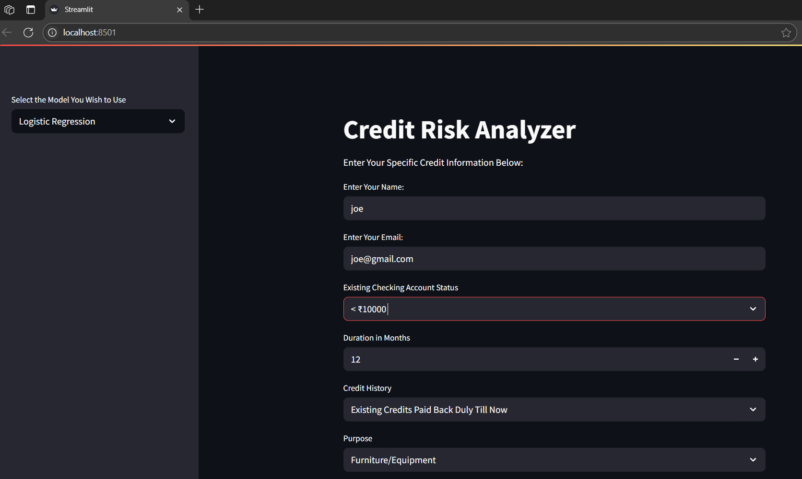
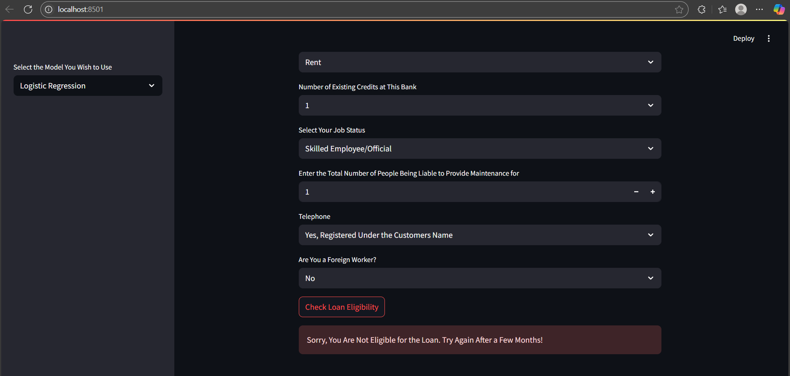
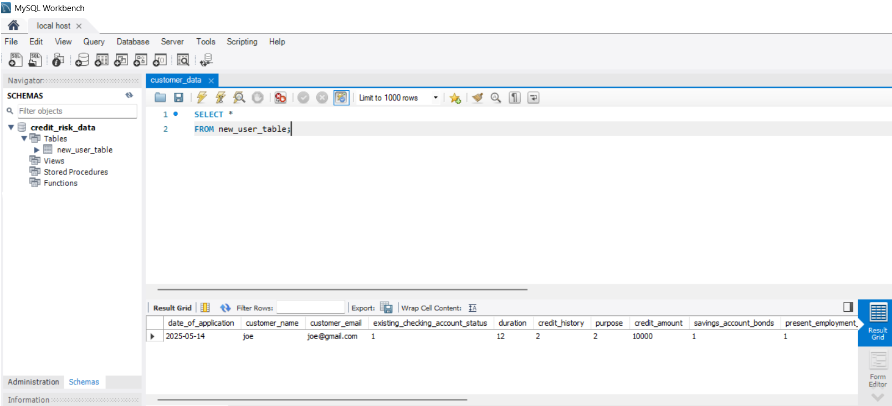

Credit Risk Analysis
==============================



This project performs credit risk analysis using the German Credit Data from the [UCI Machine Learning Repository](https://archive.ics.uci.edu/dataset/144/statlog+german+credit+data). The dataset includes 20 features and a target variable (`class`) indicating credit risk (good/bad).

The goal is to build a pipeline that preprocesses data, trains machine learning models, evaluates their performance, and deploys a prediction app using Streamlit. Additionally, results are stored in a MySQL database to enable further analysis by a data team.

---

## 📊 Dataset Overview

Here’s a brief description of the 20 features:

| Feature No. | Type        | Description                                        |
|-------------|-------------|----------------------------------------------------|
| 1           | Qualitative | Status of existing checking account                |
| 2           | Numerical   | Duration in months                                 |
| 3           | Qualitative | Credit history                                     |
| 4           | Qualitative | Purpose                                            |
| 5           | Numerical   | Credit amount                                      |
| 6           | Qualitative | Savings account/bonds                              |
| 7           | Qualitative | Present employment since                           |
| 8           | Numerical   | Installment rate (% of disposable income)          |
| 9           | Qualitative | Personal status and sex                            |
| 10          | Qualitative | Other debtors/guarantors                           |
| 11          | Numerical   | Present residence since (in years)                 |
| 12          | Qualitative | Property                                           |
| 13          | Numerical   | Age (in years)                                     |
| 14          | Qualitative | Other installment plans                            |
| 15          | Qualitative | Housing                                            |
| 16          | Numerical   | Number of existing credits at this bank            |
| 17          | Qualitative | Job                                                |
| 18          | Numerical   | Number of people being liable for maintenance      |
| 19          | Qualitative | Telephone                                          |
| 20          | Qualitative | Foreign worker                                     |

---

## 🧠 Project Overview

This project follows the [cookiecutter data science](https://drivendata.github.io/cookiecutter-data-science/) project structure for modularity and maintainability.

Key components:

- **Data processing**: Raw data is cleaned and transformed into features suitable for model training.
- **Exploratory analysis**: Conducted in Jupyter notebooks with visualizations.
- **Model training**: Multiple ML models (e.g., XGBoost, LightGBM, CatBoost) are trained and evaluated.
- **Feature transformation**: Skewed features are normalized using the Box-Cox transformation.
- **Model persistence**: Best models and Box-Cox lambda values are saved using `pickle`.
- **Deployment**: A Streamlit app accepts user inputs and predicts loan eligibility in real time.
- **Database integration**: Predictions and user data are stored in a MySQL database for tracking and feedback.

**Note**: The database integration step requires an existing database and you must provide database credentials in the `.streamlit/secrets.toml` file. Streamlit refers to this file for credentials. However, if you just wish to use the application without storing the data, you can comment out the database insertion code from app.py file.

---

## 🚀 Streamlit App


- Located in `app.py`
- Accepts user input via a web form
- Predicts loan approval using trained models
- Stores approved and rejected applicants in a MySQL database

This backend allows the credit team to:


- Review and manually process approved applications
- Tracks rejected applications
- Send feedback or credit-improving tips to rejected applicants

---

## 🧪 Jupyter Notebooks

Two notebooks are available in the `notebooks/` directory:

1. **Exploratory Data Analysis (EDA)**: Includes visualizations and feature engineering.
2. **Model Training**: Includes preprocessing, Box-Cox transformation, model training, and evaluation.

---

## 🛠️ Getting Started

To set up and run the project locally:

### 1. Clone the repository

```bash
git clone https://github.com/Suraj2699/credit-risk-analysis.git
cd credit-risk-analysis
```

### 2. Install Dependencies

```bash
pip install -r requirements.txt
```

### 3. Launch Streamlit App

```bash
streamlit run app.py
```

---

## Project Organization
------------

    ├── LICENSE
    ├── Makefile           <- Makefile with commands like `make data` or `make train`
    ├── README.md          <- The top-level README for developers using this project.
    ├── data
    │   ├── external       <- Data from third party sources.
    │   ├── interim        <- Intermediate data that has been transformed.
    │   ├── processed      <- The final, canonical data sets for modeling.
    │   └── raw            <- The original, immutable data dump.
    │
    ├── docs               <- A default Sphinx project; see sphinx-doc.org for details
    │
    ├── models             <- Trained and serialized models, model predictions, or model summaries
    │
    ├── notebooks          <- Jupyter notebooks. Naming convention is a number (for ordering),
    │                         the creator's initials, and a short `-` delimited description, e.g.
    │                         `1.0-srj-initial-data-exploration`.
    │
    ├── references         <- Data dictionaries, manuals, and all other explanatory materials.
    │
    ├── reports            <- Generated analysis as HTML, PDF, LaTeX, etc.
    │   └── figures        <- Generated graphics and figures to be used in reporting
    │
    ├── requirements.txt   <- The requirements file for reproducing the analysis environment, e.g.
    │                         generated with `pip freeze > requirements.txt`
    │
    ├── setup.py           <- makes project pip installable (pip install -e .) so src can be imported
    ├── src                <- Source code for use in this project.
    │   ├── __init__.py    <- Makes src a Python module
    │   │
    │   ├── data           <- Scripts to download or generate data
    │   │   └── make_dataset.py
    │   │
    │   ├── features       <- Scripts to turn raw data into features for modeling
    │   │   └── build_features.py
    │   │
    │   ├── models         <- Scripts to train models and then use trained models to make
    │   │   │                 predictions
    │   │   ├── predict_model.py
    │   │   └── train_model.py
    │   │
    │   └── visualization  <- Scripts to create exploratory and results oriented visualizations
    │       └── visualize.py
    │
    └── tox.ini            <- tox file with settings for running tox; see tox.readthedocs.io

--------

## Technologies Used

* Python
* Pandas
* Numpy
* Scikit-learn
* XGBoost
* LightGBM
* Catboost
* Streamlit
* MySQL

<p><small>Project based on the <a target="_blank" href="https://drivendata.github.io/cookiecutter-data-science/">cookiecutter data science project template</a>. #cookiecutterdatascience</small></p>